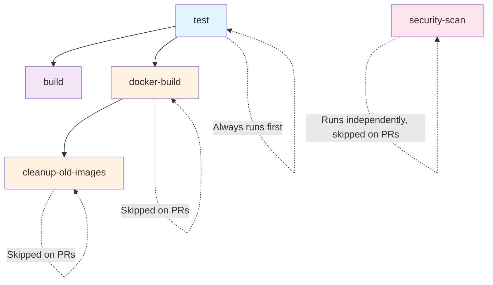
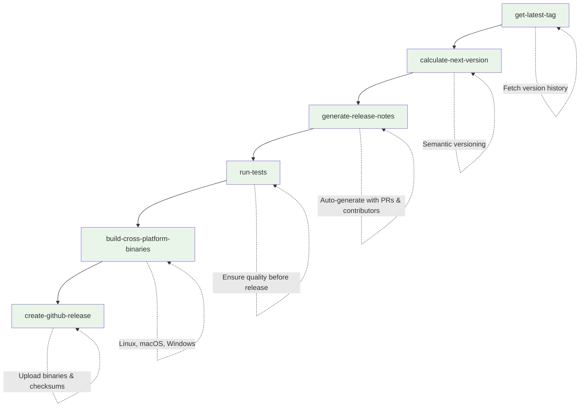

# CI/CD Workflows

This repository has two main workflows:

## 🚀 CI/CD Pipeline (`ci.yml`)

**Triggers:**

- Push to main or develop branches
- Pull requests to main branch
- Manual trigger from Actions tab

**Purpose:** Continuous integration, testing, and container management

## 🏷️ Create Release (`release.yml`)

**Triggers:**

- Manual trigger only (workflow_dispatch)

**Purpose:** Semantic versioning and release management

## Usage

1. **Development**: Push code → CI runs tests, builds, and manages containers
2. **Release**: Go to Actions → Run "🏷️ Create Release" → Choose version type (patch/minor/major)
